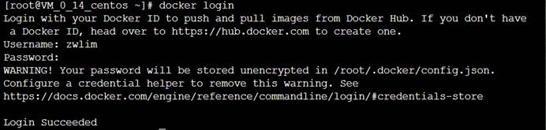

## 实验一：安装Docker

更新应用程序数据库：

```
sudo yum check-update
```

添加Docker的官方仓库，下载最新的Docker并安装：

```
curl -fsSL https://get.docker.com/ | sh
```

启动Docker

```
sudo systemctl start docker
```

设置Docker自启动

```
sudo systemctl enable docker
```

查看Docker 版本信息

```
docker version
```


## 实验二：完成Docker安装之后加载CentOS镜像

### 1.Docker加载CentOS镜像

**拉取 Centos 7**

```
docker pull centos:7
```

查看一下当前系统中存在的镜像：

```
docker images
```


**运行Docker容器**

```
docker run -d -it --privileged --name wordpress -p 8888:80 -d centos:7 /usr/sbin/init
```

**查看已启动的容器**

```
docker ps
```


**进入容器前台**

```
docker exec -it 28 /bin/bash
```

### 2.容器中安装wordpress

参考文章：[Centos上搭建wordpress](https://github.com/zwlin2/CloudComPuting/tree/master/chapter2)

安装完成后可通过浏览器访问 服务器IP:8888 查看

[

### 3.推送带有wordpress的镜像

**将容器生成镜像 (**

```
docker commit -a "zwlim" -m "wordpress on centos7" 28aec455edb7 zwlim/centos:v1
```


登录Docker**

```
docker login
```



**推送镜像**

```
docker push zwlim/centos:v1
```


**在docker hub里面查看**


## 实验三：利用Dockerfile文件创建包含WordPress的镜像

### 1.在主目录下创建下列文件,并把wordpress压缩包放在目录下


### **2.编写Dockerfile文件**


### **3.编辑start.sh**


### **4.编辑mysql.sql**


### **5.编写start.service**


### **6.编辑install.sh**


### **7.构建镜像**

```
docker build -t test .
```

### **8.运行并设置端口映射**

```
docker run -dit --privileged -p 8080:80 test
```

### **9.进入容器**

```
docker exec -it e /bin/bash
```

### **10.浏览器输入106.54.75.14:8080,输入数据库名用户名密码进入控制界面**


