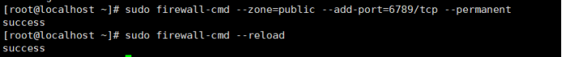

# 实验4 ceph

## 一、为了方便复制粘贴代码.使用下xshell软件进行连接,过程如下

### 1.输入ip addr命令查看不到本机的ip地址


### 2.此时查看ens33网卡配置，输入

```
vi /etc/sysconfig/network-scripts/ifcfg-ens33
```

将ONBOOT权限改为yes


### 3.然后重启网络服务

```
service network restart
```

### 4.查询ip地址获得本机的ip地址

 

### 5.在xshell新建连接输入登陆名和登陆密码连接

## 二、实验步骤

### 1.创建ceph用户并设置密码

 

### 2.为ceph用户赋予root权限

 

### 3.安装配置ntp服务

```
yum install -y ntp ntpdate ntp-doc

ntpdate 0.us.pool.ntp.org

hwclock --systohc

systemctl enable ntpd.service

systemctl start ntpd.service
```

 

### 4.安装open-vm-tool

 

### 5.禁用SELinux服务

```
sed -i 's/SELINUX=enforcing/SELINUX=disabled/g' /etc/selinux/config
```

### 6.复制虚拟机选择完整复制

 

Ceph-admin

IP：192.168.64.128

Mon1

Ip：192.168.64.131

osd1

Ip：192.168.64.130

osd2

Ip：192.168.64.129

### 7.防火墙设置

Admin节点设置防火墙

```
sudo firewall-cmd --zone=public --add-port=80/tcp --permanent

sudo firewall-cmd --zone=public --add-port=2003/tcp --permanent

sudo firewall-cmd --zone=public --add-port=4505-4506/tcp --permanent

sudo firewall-cmd --reload
```

 

Mon1节点设置防火墙

```
sudo firewall-cmd --zone=public --add-port=6789/tcp --permanent

sudo firewall-cmd --reload
```

 

Osd节点设置防火墙

```
sudo firewall-cmd --zone=public --add-port=6800-7300/tcp --permanent

sudo firewall-cmd --reload
```

 

### 8.在四个节点添加配置

```
vi /etc/hosts
```

 

### 9.切换到cephuser用户生成密钥

```
su - cephuser

ssh-keygen
```

 

### 10.vi ~/.ssh/config

添加如下配置

 

### 11.更改配置文件权限

```
chmod 644 ~/.ssh/config

ssh-keyscan osd1 osd2 mon1>> ~/.ssh/known_hosts
```

 

### 12.分发密钥

```
ssh-copy-id ceph-admin

ssh-copy-id mon1

ssh-copy-id osd1

ssh-copy-id osd2
```

测试 

 

### 13.ceph-deploy安装

```
sudo yum update && sudo yum install ceph-deploy
```

### 14.创建集群

```
mkdir cluster && cd cluster

ceph-deploy new mon1
```

编辑vi ceph.conf

  

### 15.修改mon节点主机名为mon

```
hostnamectl set-hostname mon1
```

### 16.在所有节点上安装Ceph

```
ceph-deploy install admin mon1 osd1 osd2
```

### 17.初始化mon1节点

```
ceph-deploy mon create-initial

ceph-deploy gatherkeys mon1
```

  

  

### 18.为osd创建目录

```
sudo mkdir /var/local/osd

sudo chown ceph: /var/local/osd
```

### 19. 准备所有OSDS节点

```
ceph-deploy osd prepare osd1:/var/local/osd osd2:/var/local/osd
```

   

### 20.激活OSD

```
ceph-deploy osd activate osd1:/var/local/osd osd2:/var/local/osd
```

  

### 21.将管理密钥部署到所有关联的节点

```
ceph-deploy admin admin mon1 osd1 osd2
```

 

 

### 22.在所有节点上运行以下命令来更改密钥文件的权限

```
sudo chmod 644 /etc/ceph/ceph.client.admin.keyring
```

### 23.从ceph-admin节点登录到ceph监视服务器“ mon1 ”

```
ssh mon1

sudo ceph health

sudo ceph -s
```


  